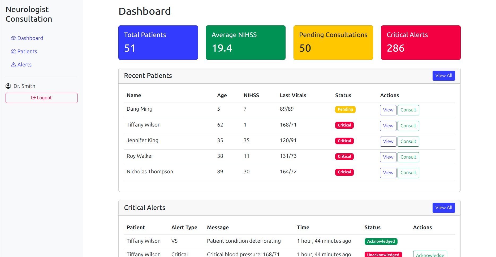

# 🧠 Neurologist Consultation System

A modern, Django-based system for managing neurological consultations and patient care. Built for neurologists and healthcare providers.

## 📊 Dashboard Preview



## 🌟 Features

- 👨‍⚕️ **Patient Management**
  - Comprehensive patient profiles
  - Medical history tracking
  - Appointment scheduling
  - Age calculation
  - Critical alerts tracking

- 🏥 **Consultation Management**
  - Detailed Consultation Records
  - Treatment Plan
  - Progress Notes
  - Follow-Up Scheduling

- 📊 **Lab Results & Imaging**
  - Upload and track lab results
  - Manage imaging studies
  - Historical data visualization
  - Vital signs monitoring
  - Lab result validation

- ⚡ **Real-time Alerts**
  - Critical result notifications
  - Appointment reminders
  - Treatment milestones
  - Pending consultation tracking

- 📱 **Modern UI/UX**
  - Responsive design
  - Intuitive navigation
  - Mobile-friendly interface

The system features a modern, intuitive dashboard that provides:

- **Key Metrics at a Glance**:
  - Total number of patients under care
  - Average NIHSS (National Institutes of Health Stroke Scale) scores
  - Number of pending consultations
  - Count of critical alerts requiring attention

- **Recent Patients Table**:
  - Patient name and age
  - Current NIHSS score
  - Latest vital signs
  - Patient status (Critical/Pending)
  - Quick actions (View/Consult)

- **Critical Alerts Section**:
  - Real-time alert monitoring
  - Alert type classification
  - Time-based tracking
  - Acknowledgment status
  - Quick acknowledgment actions

## 🚀 Getting Started

### Prerequisites

- Python 3.8+
- [Poetry](https://python-poetry.org/docs/#installation) (Python dependency management)

### Installation

1. Clone the repository:
```bash
git clone https://github.com/ktawiah/neurologist-consultation-system.git
cd neurologist-consultation-system
```

2. Install dependencies using Poetry:
```bash
poetry install
```

3. Activate the virtual environment:
```bash
poetry shell
```

4. Apply migrations:
```bash
python manage.py migrate
```

5. Create a superuser:
```bash
python manage.py createsuperuser
```

6. Load sample data (optional):
```bash
# Load sample patients
python manage.py load_sample_patients

# Generate sample medical data
python manage.py generate_sample_data
```

7. Run the development server:
```bash
python manage.py runserver
```

Visit http://127.0.0.1:8000/ to access the application! 🎉

## 🏗️ Project Structure

```
neurologist-consultation-system/
├── config/                 # Project configuration
│   └── settings/          # Settings for different environments
├── core/                  # Main application
│   ├── api/              # REST API endpoints
│   ├── models/           # Database models
│   │   ├── user.py      # User model
│   │   ├── patient.py   # Patient model
│   │   ├── medical.py   # Medical models
│   │   └── notification.py # Notification model
│   ├── serializers/      # API serializers
│   │   ├── user.py      # User serializer
│   │   ├── patient.py   # Patient serializer
│   │   ├── medical.py   # Medical serializers
│   │   └── notification.py # Notification serializer
│   ├── tests/           # Test suite
│   │   ├── models/      # Model tests
│   │   ├── serializers/ # Serializer tests
│   │   └── forms/       # Form tests
│   ├── templates/       # HTML templates
│   └── views.py         # View logic
├── static/              # Static files (CSS, JS, images)
├── pyproject.toml       # Poetry project configuration
└── manage.py           # Django management script
```

## 🧪 Testing

The application includes comprehensive test coverage for models, serializers, and forms. To run the tests:

```bash
# Run all tests
poetry run python manage.py test

# Run specific test modules
poetry run python manage.py test core.tests.models
poetry run python manage.py test core.tests.serializers
poetry run python manage.py test core.tests.forms

# Run specific test classes
poetry run python manage.py test core.tests.serializers.test_user
poetry run python manage.py test core.tests.serializers.test_patient
poetry run python manage.py test core.tests.serializers.test_medical
```

### Test Coverage

The test suite includes:

1. **Model Tests**
   - User model validation and relationships
   - Patient model with age calculation
   - Medical models (VitalSign, LabResult, ImagingStudy)
   - Notification model with alert tracking

2. **Serializer Tests**
   - User serializer with password validation
   - Patient serializer with age calculation and validation
   - Medical serializers with value validation
   - Notification serializer with alert status

3. **Form Tests**
   - User creation and update forms
   - Patient forms with validation
   - Medical forms with value constraints

## 🔒 Environment Variables

Create a `.env` file in the root directory with the following variables:

```env
DEBUG=True
SECRET_KEY=your-secret-key-here
DATABASE_URL=your-database-url-here
```

Make sure to:
- Use a strong, randomly generated secret key
- Never commit your actual credentials to version control
- Keep your `.env` file in `.gitignore`

## 📝 API Documentation

The system provides a RESTful API with the following endpoints:

### User Management
- `POST /api/users/` - Create a new user
- `GET /api/users/{id}/` - Get user details
- `PUT /api/users/{id}/` - Update user information
- `DELETE /api/users/{id}/` - Delete a user

### Patient Management
- `POST /api/patients/` - Create a new patient
- `GET /api/patients/` - List all patients
- `GET /api/patients/{id}/` - Get patient details
- `PUT /api/patients/{id}/` - Update patient information
- `DELETE /api/patients/{id}/` - Delete a patient

### Medical Records
- `POST /api/vital-signs/` - Record vital signs
- `POST /api/lab-results/` - Upload lab results
- `POST /api/imaging-studies/` - Add imaging studies
- `GET /api/patients/{id}/medical-history/` - Get patient's medical history

### Notifications
- `GET /api/notifications/` - List all notifications
- `PUT /api/notifications/{id}/acknowledge/` - Acknowledge a notification

## 🤝 Contributing

1. Fork the repository
2. Create a feature branch (`git checkout -b feature/amazing-feature`)
3. Commit your changes (`git commit -m 'Add some amazing feature'`)
4. Push to the branch (`git push origin feature/amazing-feature`)
5. Open a Pull Request

## 📄 License

This project is licensed under the MIT License - see the [LICENSE](LICENSE) file for details.

## 🙏 Acknowledgments

- Django community for the amazing framework
- All contributors who help improve this system
- Healthcare providers for their valuable feedback

## 📞 Support

Having trouble? 🤔
- Check out our [documentation](docs/)
- Create an issue
- Contact us at support@example.com

---
Made with 🧠 and ❤️ by [Walker](https://github.com/ktawiah) 
